# Assessing the Affordability of Cars in Australia

[](https://github.com/sidharthsudhi1/au-car-affordability/actions/workflows/ci.yml)

How many new cars does a year's median pay buy in Australia, how has that changed since 2014,
and which segments, states and worker groups are left behind?

A data exploration and visualisation project from Monash FIT5147 (Semester 2, July to
October 2025): data collection and wrangling in Python and R, visual exploration in R and
Tableau, a Five Design Sheet design process, and an interactive narrative visualisation in D3.

| Period | Stage |
|--------|-------|
| July - August 2025 | Topic, research questions and data collection |
| August - September 2025 | Wrangling, cleaning and visual exploration (Data Exploration Project) |
| October 2025 | Five Design Sheets and the D3 dashboard (Data Visualisation Project) |

**[Interactive dashboard](https://sidharthsudhi1.github.io/au-car-affordability/dashboard/)** ·
**[Analysis notebook](notebooks/analysis.ipynb)** ·
**[Design sheets](design/)**

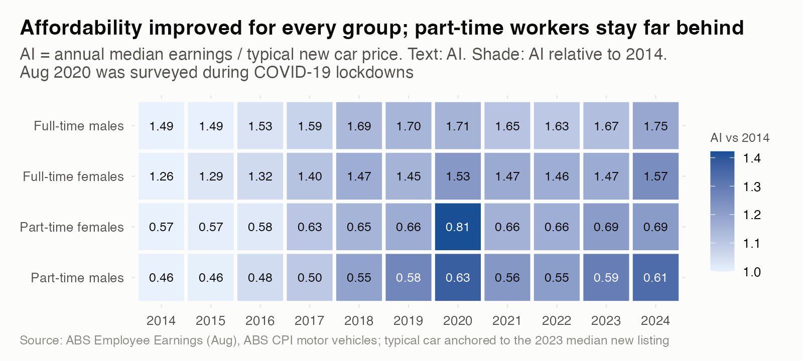

## Skills

| Area | What this repo shows | Where |
|------|----------------------|-------|
| Web scraping | Selenium navigation and BeautifulSoup parsing of Redbook detail pages, with robots.txt check and polite delays | [`scraping/`](scraping/redbook_scraper.py) |
| API data collection | SDMX queries against the ABS Data API for CPI and earnings | [`abs_api.py`](src/carafford/abs_api.py) |
| Data wrangling (Python) | 272 split brands repaired, 6,933 placeholder cells nulled, text parsed to numbers, a 50-year data cube reshaped, every filter logged | [details below](#data-wrangling-and-preprocessing) |
| Data wrangling (R) | dplyr/tidyr joins and reshapes to build the Affordability Index | [`r/common.R`](r/common.R) |
| Exploratory visualisation (R) | ggplot2 lollipop, `geom_tile` heatmap, `fmsb` radar, `ggdist` raincloud, grouped bars | [`r/`](r/), [`figures/r/`](figures/r/) |
| Visual design | Five Design Sheets, Munzner's What-Why-How, colourblind-validated palette | [`design/`](design/), below |
| Interactive visualisation (D3) | Linked timeline, choropleth with drill-down bars, Sankey, global filters, tooltips, light/dark, phone layout | [`dashboard/`](dashboard/index.html) |
| Statistical analysis | Hedonic regression with robust errors, cross-validation, bootstrap and RSE-based intervals | [`analysis.py`](src/carafford/analysis.py) |
| Reproducibility | `make` pipeline, 30 pytest checks, CI on every PR | [`Makefile`](Makefile), [`tests/`](tests/) |

## Data wrangling and preprocessing

Four raw sources in three formats (SDMX CSV from an API, a multi-header Excel-style data cube,
and scraped listing text) are turned into tested, analysis-ready tables by one command,
`make data`. Every step lives in code ([`src/carafford/`](src/carafford/)), every filter is
logged, and 30 tests run in CI.

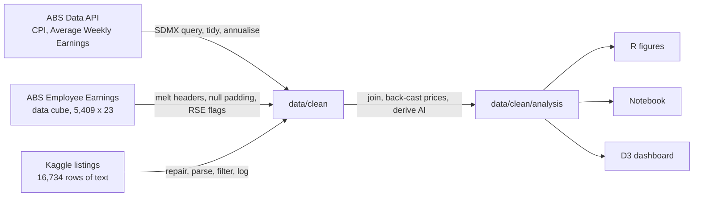

### Sources

| Source | Raw shape | Used for | Licence |
|--------|-----------|----------|---------|
| [ABS Data API](https://data.api.abs.gov.au): CPI | 638 quarterly observations | Motor vehicles and all-groups price indexes, 2012-2026 | CC BY 4.0 |
| [ABS Data API](https://data.api.abs.gov.au): Average Weekly Earnings | 783 half-yearly observations | Full-time adult earnings by sex and state | CC BY 4.0 |
| [ABS Employee Earnings](https://www.abs.gov.au/statistics/labour/earnings-and-working-conditions/employee-earnings/aug-2024) | 5,409 x 23 data cube, 1975-2024 | Median weekly earnings by sex, full/part-time, state, with standard errors | CC BY 4.0 |
| [Kaggle: Australian Vehicle Prices](https://www.kaggle.com/datasets/nelgiriyewithana/australian-vehicle-prices) | 16,734 x 19, all text | Listing price, age, km, segment, brand, state | Not stated; raw file not redistributed |
| [Natural Earth](https://www.naturalearthdata.com) | Admin-1 shapefile | State boundaries, simplified to 43 KB GeoJSON with `sf` | Public domain |

### Vehicle listings: problems found and how they were fixed

| Problem in the raw data | Rows affected | Fix |
|-------------------------|--------------:|-----|
| Two-word brands split across columns (`Land` + `Rover`, `Alfa` + `Romeo`, `Aston` + `Martin`, `Great` + `Wall`) | 272 | Brand remapped, model recovered from the listing title; `Great Wall` merged into `GWM` |
| Seat counts shifted into the `Doors` column (`" 7 Seats"`) | 71 | Moved back to `Seats` when that column was empty |
| `-`, `- / -` and `POA` placeholders instead of missing values | 6,933 cells | Converted to nulls before any parsing |
| Numbers stored as text: `"4 cyl, 2 L"`, `"5.1 L / 100 km"`, `" 5 Doors"` | every row | Regex extraction to engine litres, cylinders, fuel use, doors, seats |
| Electric cars recorded as `"0 L"` engines | 106 | Cylinders set to 0 rather than left missing |
| State buried in a suburb string (`"Blacktown, NSW"`) | 16,283 parsed | Regex on the trailing code, validated against the 8 states |
| `Car/Suv` column mostly holds dealer names, not a vehicle type | 3,214 | Dropped; `BodyType` used instead, `Ute / Tray` normalised to `Ute` |
| CamelCase and slash column names (`UsedOrNew`, `Car/Suv`) | 19 columns | Converted to snake_case |

A row before and after:

| | Brand | Engine | FuelConsumption | Location | Price |
|---|---|---|---|---|---|
| **Raw** | `Land` | `4 cyl, 2 L` | `5.1 L / 100 km` | `Blacktown, NSW` | `"62280"` (text) |
| **Clean** | `Land Rover` | `engine_litres=2.0`, `cylinders=4` | `fuel_l_100km=5.1` | `state=NSW` | `price=62280`, `age=6` |

Filters, each logged to [`listings_cleaning_log.csv`](data/clean/listings_cleaning_log.csv) so the funnel is auditable:

| Step | Rows | Dropped | Why |
|------|-----:|--------:|-----|
| Raw listings | 16,734 | | |
| Blank rows | 16,733 | 1 | Fully empty line in the export |
| Missing or POA price | 16,681 | 52 | No usable target value |
| Near-duplicate listings | 16,618 | 63 | Same title, price, km and state (relisted ads) |
| Price outside $2k-$400k | 16,593 | 25 | Deposits, parts and supercars outside the affordability question |
| Older than 20 years | 16,333 | 260 | Too few per model year for stable estimates |
| Over 500,000 km | 16,328 | 5 | Implausible odometer readings |
| "New" with over 5,000 km | 16,327 | 1 | Label contradicts mileage |
| Unknown body type | 16,043 | 284 | Cannot be assigned to a segment |

### ABS Employee Earnings cube

- **Merged two-row header** (state names spanning value and RSE columns) read separately, forward-filled and combined into `state|kind` keys, then melted and pivoted to one tidy row per year x state x sex x work status x leave.
- **12,408 zero-padded cells** for years ABS never published were converted to nulls, so they cannot be mistaken for $0 earnings.
- **Two-digit survey years** (`Aug-75`, `Aug-24`) converted to four-digit years across the 1975-2024 century boundary.
- **Reliability flags** from each cell's relative standard error, using ABS thresholds: 2,650 ok, 21 use with caution (25-50%), 2 unreliable (above 50%) and excluded from headlines.
- Indented sex labels (`"   Males"`), thousands separators and the copyright footer row cleaned out.

### ABS Data API

- SDMX keys built from the dataflow codelists (e.g. motor vehicles index `40080`, full-time adult ordinary time earnings measure `3`) and fetched as CSV, so the pipeline refreshes with `make fetch`.
- Region and sex codes mapped to readable labels; quarterly CPI and half-yearly AWE averaged to calendar years, keeping only years where every period is present.
- Discovered during validation: ABS publishes the motor vehicles index nationally only (all-groups CPI exists by capital city), so state comparisons were moved to the listings.

### Derived features

| Feature | How it is built |
|---------|-----------------|
| Affordability Index (AI) | Annual median earnings (weekly x 52) / median new price, by year, state, worker group and segment |
| Segment price by year | 2023 median new listing per segment, back-cast with the ABS motor vehicles index |
| State price | Segment price scaled by the state's like-for-like premium from the hedonic model |
| Weeks of pay | Price / weekly earnings, with 95% intervals from ABS standard errors |
| Model inputs | `age` = 2023 minus model year, `log_price`, `log1p(km)`, top-15 brands with the rest grouped as Other |

The R scripts rebuild the AI independently with `dplyr` joins and `tidyr` pivots ([`r/common.R`](r/common.R)).

### Validation

30 tests run on every PR ([`tests/`](tests/)): data validation on every clean and analysis table, plus unit tests for each parser. They include:

- Reproduces the published ABS headline: national median weekly earnings of $1,396 in August 2024.
- Complete panels: every series x region present for every year, no duplicate keys.
- Domain rules: full-time earns more than part-time, males above females in AWE, prices and ages inside their filter bounds, new cars under 5,000 km.
- Repairs hold: no split brand names remain, null rates under 5% for km and state.
- The funnel arithmetic adds up: raw rows minus logged drops equals clean rows.

### The audit that changed the method

Profiling the listings showed a single 2023 snapshot in which 90% of cars are used: median
odometer falls from 129,000 km for 2014 models to 20 km for 2023 models. `Year` is therefore a
model year, and price by year measures depreciation, not price change over time. Trends now
come from the ABS motor vehicles index; the listings drive segment, brand, state and
depreciation comparisons.

## Design process

The dashboard was planned with the Five Design Sheet method: brainstorm and filter idioms,
three alternative layouts, then a final realisation sheet specifying layout, operations
(year slider, segment filter, state click, flow hover) and focus views.

| Sheet 1: brainstorm | Sheets 2-4: alternatives | Sheet 5: realisation |
|---|---|---|
| [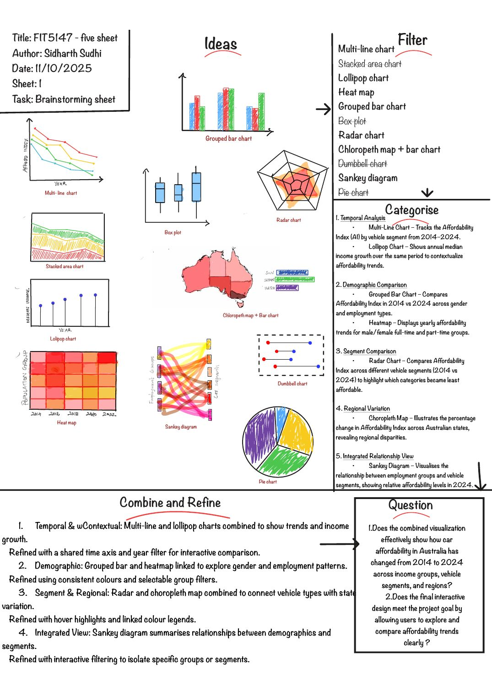](design/sheet-1.jpg) | [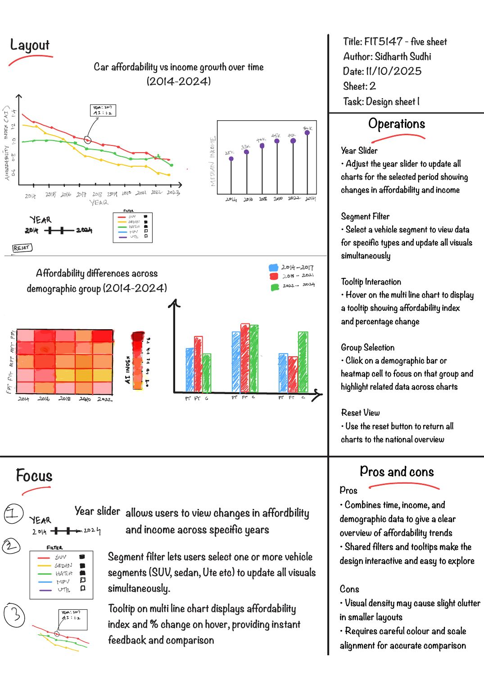](design/sheet-2.jpg) [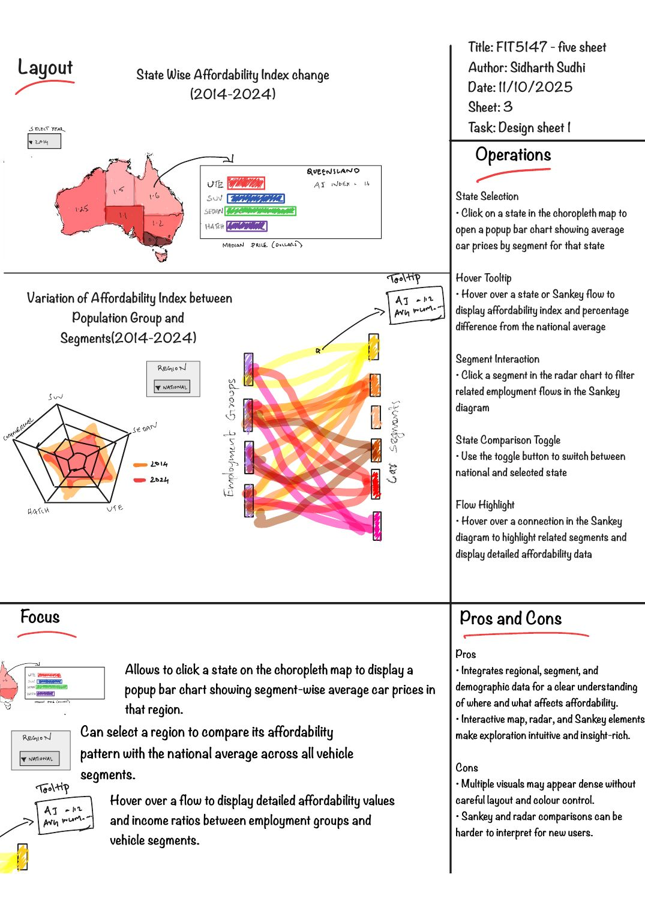](design/sheet-3.jpg) [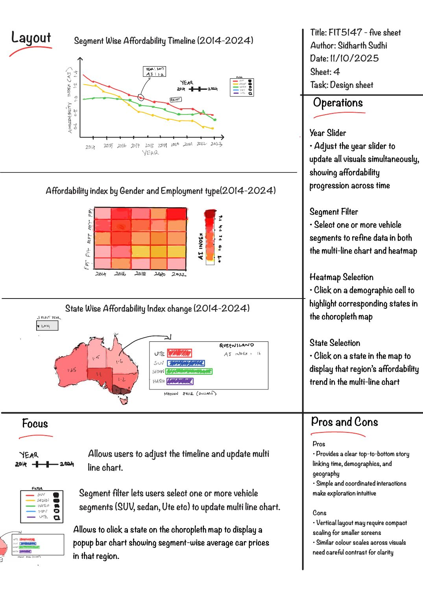](design/sheet-4.jpg) | [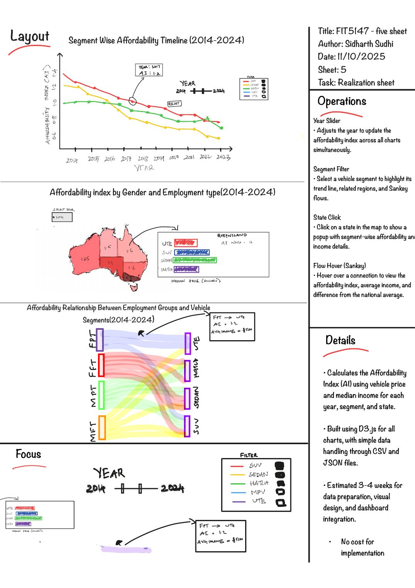](design/sheet-5.jpg) |

**What:** a 2014-2024 time series, categorical segments and worker groups (sex x full/part-time),
and state geography, joined through a derived Affordability Index (AI = annual median earnings /
median new price). **Why:** identify national trends, compare segments and groups, and locate
regional differences. **How:** a multi-line timeline (position on a common scale for slopes),
a choropleth paired with a ranked bar panel (overview plus accurate magnitude), and a Sankey
from groups to segments (link width for magnitude), all driven by one control bar.

## Interactive dashboard

[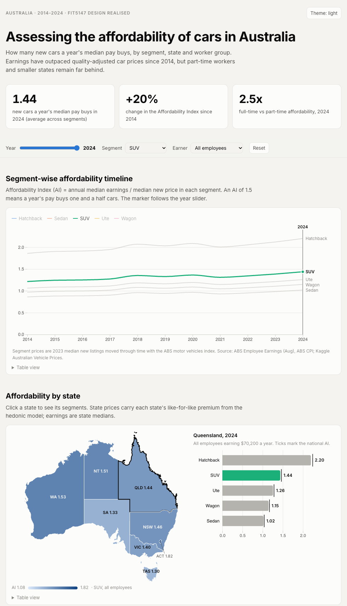](https://sidharthsudhi1.github.io/au-car-affordability/dashboard/)

The [live page](https://sidharthsudhi1.github.io/au-car-affordability/dashboard/) implements sheet 5:
a global year slider, segment and earner filters; a segment-wise AI timeline; a state choropleth
whose click drives a segment bar panel with national comparison ticks; and a Sankey from
employment groups to segments that switches between AI and weeks of pay. Every chart has hover
details and a table view.

## Exploration in R

| | |
|---|---|
| 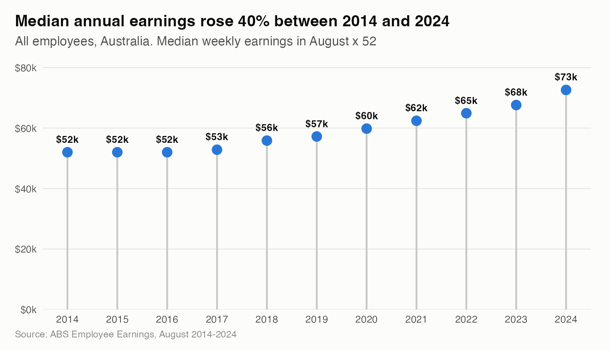 | 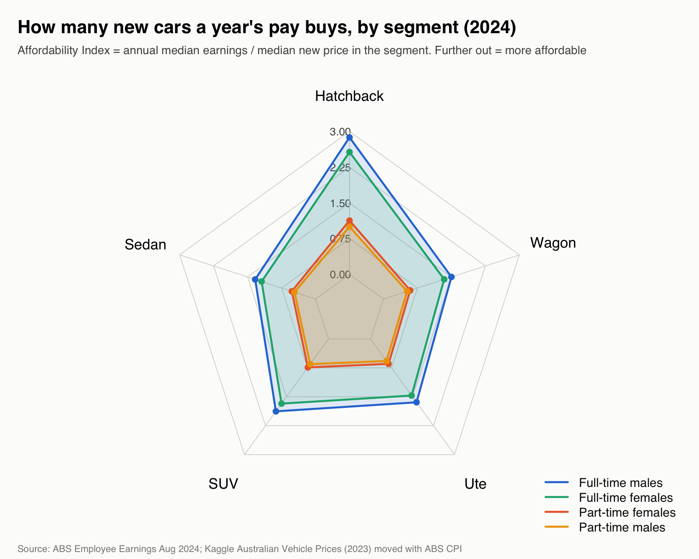 |
| 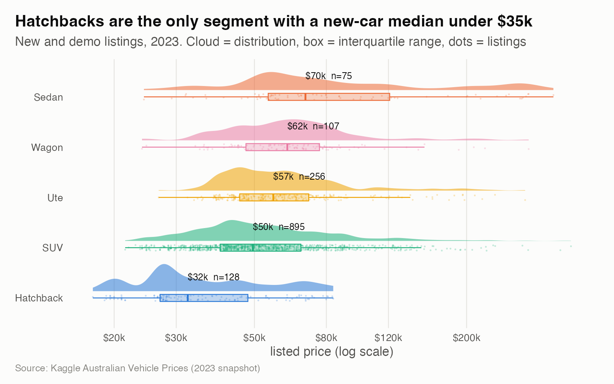 | 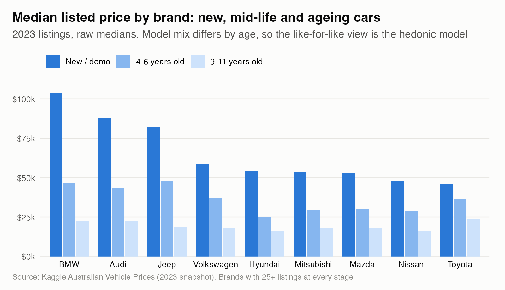 |

## Findings

- **Cars became more affordable.** The AI for all employees rose about 20% from 2014 to 2024: earnings grew 40% while quality-adjusted car prices grew about 16%. The 2021-23 supply shortage paused the gain without reversing it.
- **Work status dominates.** In 2024 a full-time worker's pay buys about 2.5 times as much car as a part-time worker's. Part-time men need the most weeks of pay (52 for a hatchback, 112 for a sedan).
- **Hatchbacks are the affordable segment, and they are disappearing.** Cheapest new ($32k median) and slowest to depreciate, but only 8% of 2023 models, while SUVs and utes rose from 51% of 2014 models to 79%.
- **State differences are mostly mix.** Tasmania's 21% raw price gap disappears like-for-like; Victoria (+4.6%) and WA (+2.6%) carry real premiums. ACT has the highest AI because its earnings are highest.
- **Brand drives resale.** Toyota keeps 72% of its value after five years; BMW and Mercedes-Benz 53%.

## Analysis extension

A hedonic regression (log price on age, km, segment, brand, state, fuel, gearbox and drive, HC3
errors) separates like-for-like price differences from mix. 5-fold cross-validation: out-of-sample
R² 0.72, MAPE 25% against 53% for a segment-median baseline. The
[notebook](notebooks/analysis.ipynb) walks through the full analysis.

| | |
|---|---|
| 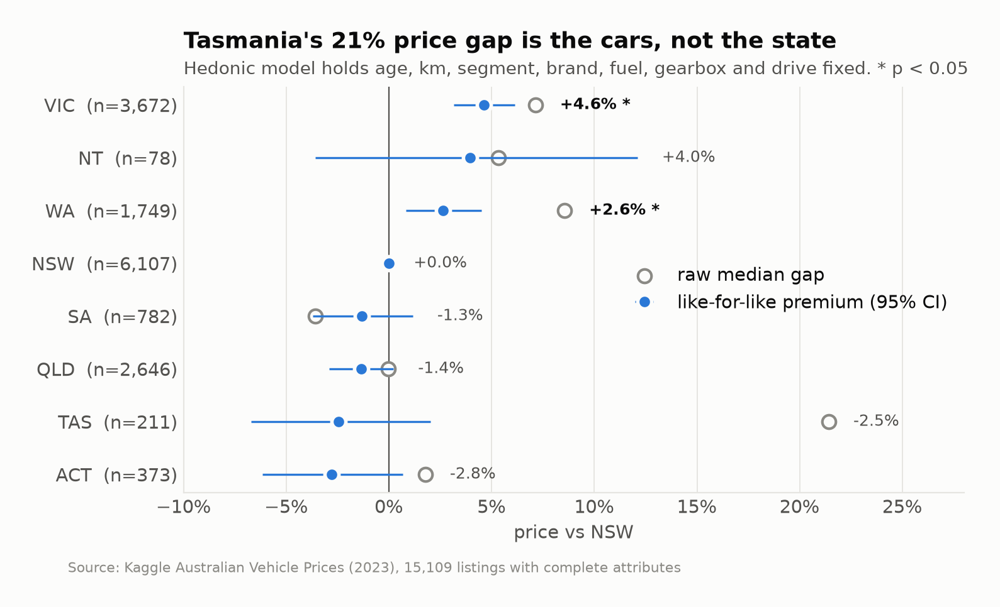 | 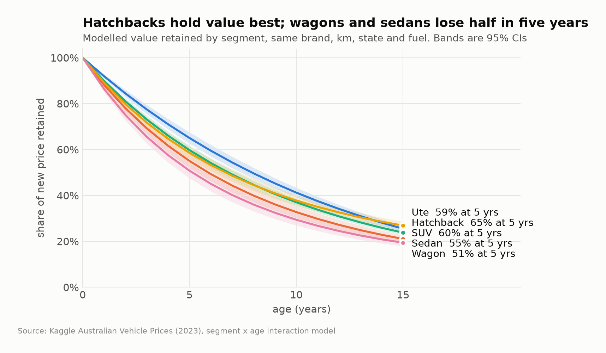 |

## Reproduce

```
make setup
make fetch          # ABS series; place the Kaggle CSV at data/raw/australian_vehicle_prices.csv first
make tables figures r notebook
make test
python -m http.server   # then open http://localhost:8000/dashboard/
```

```
scraping/        Selenium + BeautifulSoup scraper
src/carafford/   Python wrangling, analysis and figures
r/               R wrangling and exploratory figures
dashboard/       D3 dashboard and state boundaries
design/          five design sheets
data/clean/      tidy tables and analysis outputs
notebooks/       end-to-end analysis
tests/           pytest suite
```

## Limitations

- The motor vehicles index is national and quality adjusted, so segment and state prices move together over time; their differences come from the 2023 listings.
- Listing prices are asking prices from one snapshot, not transactions.
- Earnings are per employee; household income and the self-employed are out of scope.
- Redbook now blocks automated browsers, so the scraper documents the collection method and the analysis uses the Kaggle listings.
