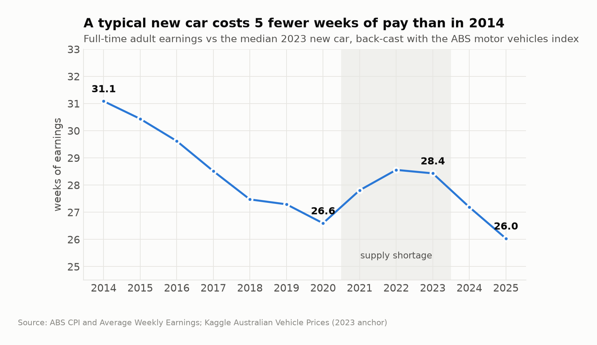
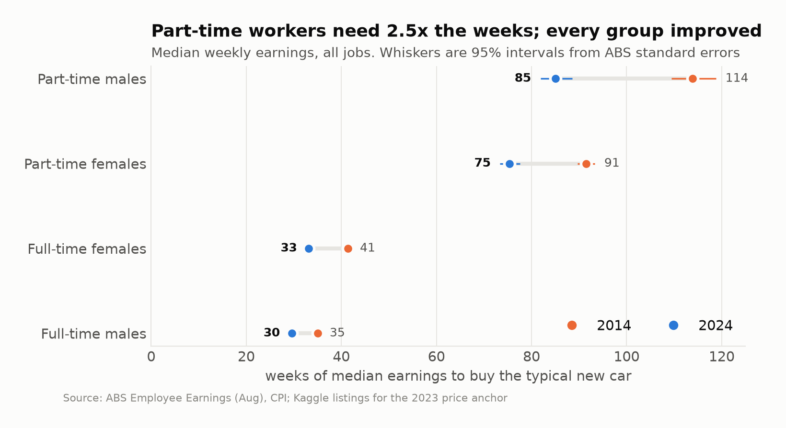
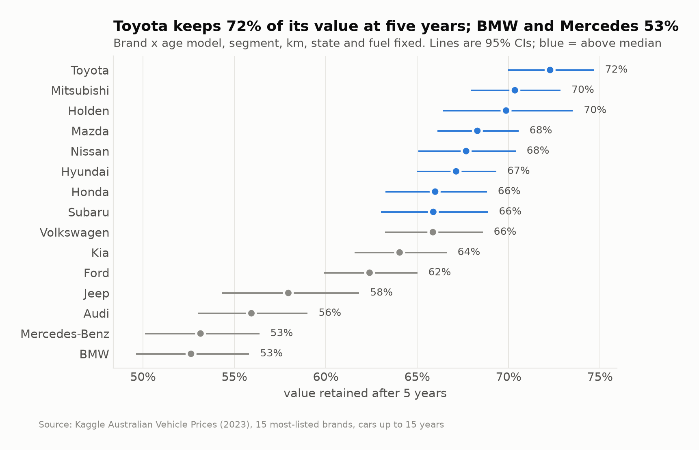
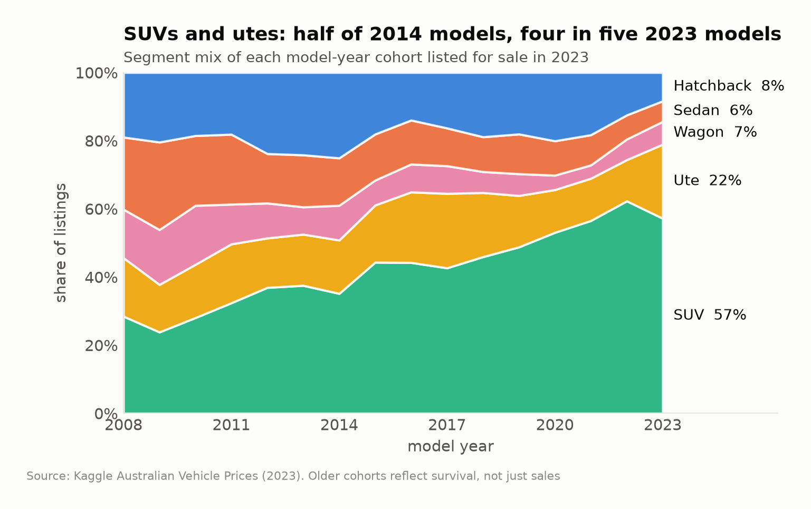

# AU Car Affordability

[](https://github.com/sidharthsudhi1/au-car-affordability/actions/workflows/ci.yml)

How many weeks of pay does a new car cost an Australian worker, how has that changed
since 2014, and where in the market does the burden fall?

**[Interactive dashboard](https://sidharthsudhi1.github.io/au-car-affordability/dashboard/)** ·
**[Analysis notebook](notebooks/analysis.ipynb)**



## Findings

| | |
|---|---|
| **Cars got more affordable** | A typical new car took 31.1 weeks of full-time earnings in 2014 and 26.0 in 2025. Quality-adjusted car prices rose 16%; earnings rose 39%. |
| **The 2021-23 shortage was absorbed** | Car prices jumped 16% in three years, but affordability only slipped back to 2017 levels before improving again. |
| **Work status matters more than time** | Part-time workers need about 2.5x the weeks of full-time workers. Part-time men need the most (85 weeks in 2024). Full-time women need 12% more weeks than full-time men. |
| **State gaps are mostly mix** | Tasmania's 21% raw price gap vanishes like-for-like (-2.5%, not significant). Victoria (+4.6%) and WA (+2.6%) carry real premiums. |
| **Hatchbacks are the value play, and disappearing** | Cheapest new ($32k) and slowest to depreciate (65% kept at 5 years), yet only 8% of 2023 models. SUVs and utes went from 51% of 2014 models to 79%. |
| **Brand beats segment for resale** | Toyota keeps 72% of its value at five years; BMW and Mercedes-Benz 53%. |

## Data

| Source | Used for | Licence |
|--------|----------|---------|
| [ABS Data API](https://data.api.abs.gov.au): CPI | Motor vehicles, fuel and all-groups price indexes, quarterly 2012-2026 | CC BY 4.0 |
| [ABS Data API](https://data.api.abs.gov.au): Average Weekly Earnings | Full-time adult ordinary time earnings by sex and state, half-yearly | CC BY 4.0 |
| [ABS Employee Earnings, Aug 2024](https://www.abs.gov.au/statistics/labour/earnings-and-working-conditions/employee-earnings/aug-2024) | Median weekly earnings by sex, full/part-time and state, with standard errors, 2014-2024 | CC BY 4.0 |
| [Kaggle: Australian Vehicle Prices](https://www.kaggle.com/datasets/nelgiriyewithana/australian-vehicle-prices) | 16.7k listings from 2023: price, age, km, segment, brand, state | Not stated, so the raw file is not redistributed |

**The listings are a 2023 snapshot, not a time series.** `Year` is the model year of a car
listed in 2023, and 90% of listings are used, so price by model year measures depreciation.
Change over time therefore comes from the ABS motor vehicles index, anchored in dollars to the
median 2023 new listing ($52,979). The listings carry the market-structure questions.

## Wrangling

`make data` rebuilds every table from `data/raw/` (`src/carafford/build.py`).

- **ABS Data API:** SDMX queries for CPI and AWE, tidied and annualised, keeping only years with every quarter or half present.
- **Employee Earnings cube:** merged two-row headers (state over value/RSE) melted to long format; zero-padded unpublished years nulled; each cell flagged ok / caution / unreliable from ABS standard error thresholds.
- **Listings:** brands split across columns ("Land" + "Rover") rebuilt from titles; seat counts shifted into the doors column moved back; engine size, cylinders, fuel use, km, doors and seats parsed from text; `-` and `POA` nulled; state parsed from suburb strings.

Every listing filter is logged ([cleaning log](data/clean/listings_cleaning_log.csv)):

| Step | Rows | Dropped |
|------|-----:|--------:|
| Raw listings | 16,734 | |
| Blank rows | 16,733 | 1 |
| Missing or POA price | 16,681 | 52 |
| Near-duplicate listings | 16,618 | 63 |
| Price outside $2k-$400k | 16,593 | 25 |
| Older than 20 years | 16,333 | 260 |
| Over 500,000 km | 16,328 | 5 |
| "New" with over 5,000 km | 16,327 | 1 |
| Unknown body type | 16,043 | 284 |

## Analysis

`make tables` writes every result to `data/clean/analysis/` (`src/carafford/analysis.py`).

- **Affordability index:** weeks of earnings to buy the typical new car, by state, sex and work status. Group intervals come from ABS relative standard errors.
- **Hedonic price model:** OLS on log price with age, age², log km, segment, brand, state, fuel, gearbox and drive; HC3 robust errors. 5-fold CV: out-of-sample R² 0.72, MAPE 25% against 53% for a segment-median baseline.
- **State premiums:** raw median gaps compared with model-adjusted premiums and 95% CIs.
- **Depreciation:** segment x age and brand x age interaction models; retention reported as contrasts against age 0 with CIs.
- **Mix shift:** segment shares by model-year cohort, priced at 2023 segment medians (bootstrap CIs).


## Visualisation

- **[Dashboard](https://sidharthsudhi1.github.io/au-car-affordability/dashboard/)** (D3, single file): affordability by region and sex with a crosshair tooltip, a pay calculator across segments, an animated raw vs like-for-like state view, and linked depreciation views. Light and dark themes, phone layout, and a table view for every chart.
- **Static figures** (`make figures`): one module builds every chart in the README and notebook with a colourblind-validated palette and direct labels.

| | |
|---|---|
|  |  |
|  |  |

## Reproduce

```
make setup
make fetch     # pull ABS series (needs the Kaggle CSV at data/raw/australian_vehicle_prices.csv)
make tables figures notebook
make test      # 27 checks: parsers, data validation, analysis outputs
```

View the dashboard locally with `python -m http.server` from the repo root, then open
`http://localhost:8000/dashboard/`.

```
src/carafford/   abs_api, earnings, listings (wrangling) · analysis · figures
data/raw/        ABS source files (Kaggle file gitignored)
data/clean/      tidy tables and analysis outputs
notebooks/       end-to-end analysis
dashboard/       interactive D3 page
tests/           pytest suite
```

## Limitations

- The motor vehicles index is quality adjusted: it prices a like-for-like car, not what buyers actually spend.
- Listing prices are asking prices from one snapshot, not transactions.
- Cohort mix in 2023 listings reflects survival and resale as well as original sales.
- Earnings are per employee; household income and the self-employed are out of scope.
